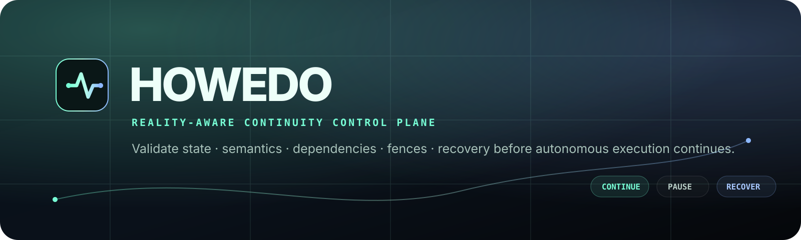

# HOWEDO

**Reality-aware continuity and integrity control plane for long-lived and autonomous AI agents.**

[](https://github.com/eimyroot/HOWEDO/actions/workflows/ci.yml)
[](https://github.com/eimyroot/HOWEDO/actions/workflows/container.yml)
[](https://github.com/eimyroot/HOWEDO/actions/workflows/consolidation.yml)
[](LICENSE)
[](pyproject.toml)
[](docs/RELEASE_READINESS.md)

HOWEDO answers one operational question:

> **Is the reality this execution depends on still valid enough for the agent to continue?**

Persistence can restore what an agent knew. HOWEDO evaluates whether that state, its dependencies,
its semantic assumptions, concurrent-write fences, and recovery binding are still valid **now**.

**Start here:** [Architecture](docs/ARCHITECTURE.md) · [Release readiness](docs/RELEASE_READINESS.md) · [Security](SECURITY.md) · [Contributing](CONTRIBUTING.md) · [Governance](GOVERNANCE.md) · [Changelog](CHANGELOG.md) · [Support](SUPPORT.md)

## Operator cockpit

HOWEDO ships a lightweight cockpit in the same FastAPI process as the service API.

```text
http://127.0.0.1:8000/
http://127.0.0.1:8000/cockpit
```

The cockpit is intentionally presentation-only. It does not own continuity semantics, persistence,
or runtime control. It calls the same public API that external consumers use.

### Run with Docker Compose

```bash
docker compose up --build
```

Then open `http://127.0.0.1:8000/`.

### Run from Python

```bash
python -m venv .venv
source .venv/bin/activate
python -m pip install -e '.[api]'
howedo-cockpit
```

Use a non-loopback bind only when you intentionally want to expose the service:

```bash
howedo-cockpit --host 0.0.0.0 --port 8000
```

Health and API surface:

```text
GET  /health
GET  /ready
GET  /docs
POST /v1/continuity/check
POST /v1/recovery/check
```

## Decision contract

Every continuity evaluation resolves to one of five actions:

| Action | Meaning |
| --- | --- |
| `CONTINUE` | The bound reality is still valid for normal continuation. |
| `PAUSE` | The execution must stop and wait for a safe condition or operator action. |
| `REVALIDATE` | The execution requires a fresh validation step before proceeding. |
| `ABORT` | The bound execution must not continue. |
| `RECOVER` | A validated recovery binding permits safe continuation from a checkpoint. |

## Architecture

```text
┌─────────────────────────────────────────────────────────────┐
│ Presentation boundary                                       │
│ Cockpit · FastAPI · OpenAPI                                 │
└──────────────────────────────┬──────────────────────────────┘
                               │
┌──────────────────────────────▼──────────────────────────────┐
│ Application/service boundary                                │
│ Request validation · DTO mapping · stable public endpoints  │
└──────────────────────────────┬──────────────────────────────┘
                               │
┌──────────────────────────────▼──────────────────────────────┐
│ Continuity kernel                                            │
│ STATE · SEMLOCK · RECALL · CONCUR · RECOVERY · DECISION     │
└──────────────────────────────┬──────────────────────────────┘
                               │
┌──────────────────────────────▼──────────────────────────────┐
│ Evidence + trust                                             │
│ Witness · conformance · in-toto · trust policy · TUF        │
└──────────────────────────────┬──────────────────────────────┘
                               │
┌──────────────────────────────▼──────────────────────────────┐
│ Adapters                                                     │
│ PostgreSQL · LangGraph · Temporal · future runtime bridges   │
└─────────────────────────────────────────────────────────────┘
```

The architecture rule is strict: **adapters and presentation may invoke HOWEDO semantics; they do
not redefine them.** Detailed scaffold and dependency-direction rules are in
[`docs/ARCHITECTURE.md`](docs/ARCHITECTURE.md).

## Core subsystems

- **State Registry** — immutable resource identities and exact revisions.
- **SEMLOCK** — semantic snapshot and compatibility checks.
- **RECALL** — dependency graph and propagated invalidation.
- **CONCUR** — expected-head checks, fencing, and conflict detection.
- **Recovery** — safe-resume validation against current reality.
- **Decision Engine** — deterministic continuity decisions.
- **Continuity Witness** — reproducible evidence for each decision.

## Minimal API example

```bash
curl -sS http://127.0.0.1:8000/v1/continuity/check \
  -H 'content-type: application/json' \
  -d '{
    "snapshot": [{
      "resource_id": "repo://example",
      "revision": "git:abc",
      "digest": "sha256:abc"
    }],
    "current_heads": [{
      "resource_id": "repo://example",
      "revision": "git:abc",
      "digest": "sha256:abc"
    }]
  }'
```

For exact matching state, the expected action is `CONTINUE` and the response includes a continuity
witness. Unknown, stale, incompatible, or conflicting state is handled by the kernel rather than
silently treated as current.

## Installation profiles

The continuity core has no required runtime or cryptography dependencies:

```bash
pip install howedo-continuity
```

Optional integrations are isolated extras:

```bash
pip install 'howedo-continuity[api]'
pip install 'howedo-continuity[postgres]'
pip install 'howedo-continuity[langgraph]'
pip install 'howedo-continuity[temporal]'
pip install 'howedo-continuity[tuf]'
```

Maintainer tooling:

```bash
pip install -e '.[dev,api,postgres,langgraph,temporal,tuf,release]'
```

## Runtime adapter contract

`howedo.runtime-adapter.v1` keeps the interoperability boundary deliberately narrow:

```text
exact runtime identity
        ↓
capture HOWEDO recovery binding
        ↓
validate against current reality
        ↓
RECOVER only
        ↓
continue exact bound execution
```

Implemented reference integrations:

- PostgreSQL persistence adapter;
- LangGraph OSS exact checkpoint binding;
- Temporal OSS exact `namespace + workflow_id + run_id` binding;
- Sigstore/Cosign verification for the reference trust flow;
- The Update Framework (TUF) for optional trust-profile distribution and root rotation.

Future adapters can target other runtimes without moving continuity semantics out of the kernel.

## Evidence and trust chain

HOWEDO contains a pre-1.0 engineering chain for:

```text
adapter conformance
      ↓
content-addressed artifact
      ↓
in-toto statement
      ↓
cryptographic verification
      ↓
consumer trust policy
      ↓
independent certification replay
      ↓
optional TUF trust distribution
      ↓
release bundle + SBOM + provenance
```

Reference CLIs include:

```bash
howedo-verify-conformance
howedo-build-attestation
howedo-verify-attestation
howedo-verify-sigstore-trust
howedo-build-certification-package
howedo-verify-certification-package
howedo-fetch-consumer-trust-profile
howedo-build-trust-root-publication
howedo-verify-trust-root-publication
howedo-build-release-bundle
howedo-verify-release-bundle
```

## Repository quality gates

The canonical repository uses:

- protected `main` and pull-request-based change flow;
- CODEOWNERS and an evidence-first PR template;
- structured bug/feature issue intake;
- Python 3.12/3.13 CI;
- Ruff and pytest;
- release-candidate wheel/sdist verification;
- container build, smoke, provenance, and SBOM workflows;
- deterministic repository-hygiene checks;
- explicit security, support, governance, contribution, and change-history contracts.

Run the local baseline:

```bash
python -m pip install -e '.[dev,api]'
ruff check .
pytest
python scripts/check_repo_hygiene.py
```

## Production boundary

HOWEDO is **pre-1.0 release-candidate engineering**, not a claim of independently audited
production trust infrastructure.

The repository includes software contracts, verification mechanisms, and operational runbooks.
Production trust-root activation, public package publication, external security review, and any
production deployment authority remain separate gates.

See [`docs/RELEASE_READINESS.md`](docs/RELEASE_READINESS.md).

## Documentation map

| Area | Canonical document |
| --- | --- |
| Architecture | [`docs/ARCHITECTURE.md`](docs/ARCHITECTURE.md) |
| Release truth | [`docs/RELEASE_READINESS.md`](docs/RELEASE_READINESS.md) |
| Continuity principles | [`docs/CONSTITUTION.md`](docs/CONSTITUTION.md) |
| Architecture decisions | [`docs/adr/`](docs/adr/) |
| Operations | [`docs/operations/`](docs/operations/) |
| Integration examples | [`examples/`](examples/) |
| Security | [`SECURITY.md`](SECURITY.md) |
| Contribution workflow | [`CONTRIBUTING.md`](CONTRIBUTING.md) |
| Governance | [`GOVERNANCE.md`](GOVERNANCE.md) |
| Support | [`SUPPORT.md`](SUPPORT.md) |
| Change history | [`CHANGELOG.md`](CHANGELOG.md) |

## Canonical invariant

> **Persistence tells you what the agent knew. HOWEDO determines whether it is still valid to act on it.**
